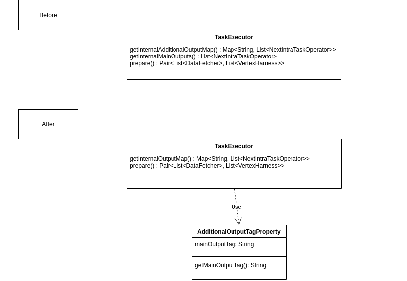

# Report for assignment 4

This is a template for your report. You are free to modify it as needed.
It is not required to use markdown for your report either, but the report
has to be delivered in a standard, cross-platform format.

## Project

Name: Apache Nemo

URL: https://github.com/apache/incubator-nemo

Apache Nemo is a data processing system currently under development.
## Nemo overview
### Purpose
The purpose of Nemo is to increase the performance and efficiency of an application via flexible control of its runtime behaviour. By adapting the runtime behaviour it can be adapted to fit any characteristics and/or situation, which leads to greater efficiency.

### General Architecture
The data processing of Nemo is done in two steps, compilation and runtime. While runtime is more or less what one might expect, the compilation is somewhat less intuitive. First, the compiler will be explained in a larger scope followed by runtime. Then, deeper explanation regarding key concepts and structures.

#### Compiler
In order for Nemo to increase the efficiency and optimize runtime, it first has to come up with a plan. While it's easy to assume that the compiler compiles code in a traditional sense, this is actually not the purpose of the compiler.
The compiler produces what is know as Nemo Intermediate Representation or 'IR' which is, in essence, a description of the *order of operations* of runtime. More on the IR later.
The compiler works in three stages. The frontend, the optimization and the backend.

##### Frontend
The frontend is what works directly against the process being optimized. It is here that the Nemo intermediate Representation is first created. The frontend translates high-level data-flow programming languages into IR. The frontend traverses the dataflow logic in topological order and appends their IR counterpart to an IR builder. After checking integrity, the IR is built.

##### Optimizer
The optimizer uses what is know as a _Nemo policy_ to optimize the flow within the IR. It is here where the true function of Nemo lays. The optimization is done in several _passes_. A policy might have several optimizations provided in a critical order. Each optimization requires a separate pass over the IR.

##### Backend
The backend finalizes the plan for execution. The IR is traversed and translated into a _physical execution plan_. The IR vertices (operations) are grouped based on stage numbers. In this manner, all vertices with the same stage number can be concurrently performed to increase performance. These operations are hereon denoted as 'tasks'. The backend passes the tasks, stage group and some additional data dependency information to the runtime execution. This physical plan can be seen as a directed acyclic graph (DAG).

#### Runtime
Now Nemo is ready to execute the _Physical execution plan_. In order to cope with the parallelism, Nemo uses a primary/master runtime 'master' as well as several secondary/slave 'executors'.
The master keeps track of the execution plan while the executor performs the stages. Apart from just managing when to execute what, the master and the executors also share some data storage. This storage is actively managed by the RuntimeMaster. So when tasks need to share information it is done through 'Blocks' in a common storage. Special modules within the master and executors handle this correspondence.

### Optimization staples

#### Optimization pass
An optimization pass is one pass over the IR where a specific optimization is being applied.

#### Nemo Policies
A collection of complete optimization passes is called a _Nemo Policy_. This policy might be designed to have a very specific impact on the runtime. The effects of a policy can be very diverse. The diverse and modular nature of the policies is what gives Nemo its great flexibility.

#### Nemo Intermediate Representation
Nemo Intermediate Representation, IR, is an abstraction of a data format used to describe the data flow of an application. The IR can be seen as a directed acyclic graph, DAG, and consists of vertices and edges. There are different kinds of vertices for different actions such as logical operation and input/output. It is this standardized format that allows for efficient optimization of dataflow.

### Summary
Nemo works in two stages with additional sub-stages
- Compilation:

    - Translation of data flow to IR

    - Optimization of IR

    - Translate IR to the execution plan

- Runtime execution

    - A master keeps track of the state of the execution plan and all tasks.

    - Several executors perform atomized tasks or groups of tasks.

## Selected issue(s)

Title: Refactor getInternal(Main/Additional)OutputMap in TaskExecutor

URL: https://issues.apache.org/jira/browse/NEMO-253

There are two separate methods to get main or additional output maps in TaskExecutor. The refactor task consist to merge the both beacause they share a lot of code.

## Onboarding experience

Everything build as documented if we respect all the prerequisities.

## Requirements affected by functionality being refactored

The function to be refactored ("getInternalMainOutputs" and "getInternalAdditionalOutput") are part of the [TaskExecutor class](https://github.com/apeinot/incubator-nemo/blob/lab4/runtime/executor/src/main/java/org/apache/nemo/runtime/executor/task/TaskExecutor.java). They are called in the "prepare" method which is called in the constructor of the class. All these functions have to be taken into account to plan the refactoring. The following tables describe the requirements of the class TaskExecutor and the relevant functions.

| Identifier                      | TaskExecutor                                                                                                                                                           |
|---------------------------------|------------------------------------------------------------------------------------------------------------------------------------------------------------------------|
| Title                           | Executing a task                                                                                                                                                       |
| Requirement Description         | Dispose from an object that can contain and execute a given task                                                                                                       |
| Validity checks on inputs       | The constructor from the class shall only accept input that matches the type given in the constructor declaration                                                                |
| Sequence of Operations          | A TaskExecutor object shall contain all the needed information on a task and be able to execute it when asked                                                          |
| Response to abnormal situations | The class shall throw exceptions if an unexpected behaviour or use is detected                                                                                         |
| Effect of Parameters            | The attributes from the class shall contain all the info to execute a task                                                                                             |
| Relationship of output to input | To be created, a TaskExecutor needs all the info related to a task. The TaskExecutor shall be able to return the information related to the execution of the given task |
| Priority                        | Very high                                                                                                                                                              |
| Verifiability                   | A TaskExecutor object should be instantiated with the correct inputs and run the corresponding task when asked                                                           |
| Dependency                      |                                                                                                                                                                        |

| Identifier                      | constructor                                                                                                                           |
|---------------------------------|---------------------------------------------------------------------------------------------------------------------------------------|
| Title                           | Building a TaskExecutor                                                                                                               |
| Requirement Description         | A constructor which creates a new TaskExecutor and sets instance variables. A TaskExecutor is an object that can execute a given task |
| Validity checks on inputs       | The constructor shall only accept input that matches the type given in the constructor declaration                                                     |
| Sequence of Operations          | The constructor shall set all instance variables to the variables given as input, then invoke the prepare method                      |
| Response to abnormal situations | The method shall throw an exception upon encountering abnormal behavior                                                               |
| Effect of Parameters            | The parameters shall specify the task to be executed as well as the instance variables of the class                                   |
| Relationship of output to input | The input defines the parameters of the class. There are no real output of the method except the new object itself.                     |
| Priority                        | High                                                                                                                                  |
| Verifiability                   | After creation, all instance variables are set according to the input when creating the class, and the prepare method is called       |
| Dependency                      | TaskExecutor                                                                                                                            |

| Identifier                      | prepare                                                                                                                                                                                                                               |
|---------------------------------|---------------------------------------------------------------------------------------------------------------------------------------------------------------------------------------------------------------------------------------|
| Title                           | Preparing the task for execution                                                                                                                                                                                                      |
| Requirement Description         | A method which can set up the necessary input variables required to fetch internal outputs and handles the main control flow. At the end of the execution, the task contained in the TaskExecutor should be ready to execute.           |
| Validity checks on inputs       | The function shall only accept input that matches the type given in the method handle                                                                                                                                                 |
| Sequence of Operations          | The method shall first create a map mapping edges to indexes and a map mapping IRVertex to InputWatermarkManager, after which it shall invoke the getInternal methods and set up the relevant variable for the task and sub-tasks |
| Response to abnormal situations | The method shall throw an exception upon encountering abnormal behavior                                                                                                                                                               |
| Effect of Parameters            | The parameters shall specify the task, a DAG and an IntermediateDataIOFactory used for communication with other tasks                                                                                                                 |
| Relationship of output to input | The method shall return fetchers and harnesses given by the task to be executed                                                                                                                                                       |
| Priority                        | High                                                                                                                                                                                                                                  |
| Verifiability                   | During its execution, the method creates a map mapping edges to indexes, and a map mapping IRVertex to InputWatermarkManager and invokes both getInternal methods                                                                     |
| Dependency                      | constructor                                                                                                                                                                                                                           |

| Identifier                      | getInternalMain                                                                                                                                                                                                   |
|---------------------------------|-------------------------------------------------------------------------------------------------------------------------------------------------------------------------------------------------------------------|
| Title                           | Fetching main Intra Tasks info                                                                                                                                                                                    |
| Requirement Description         | The method can identify edges without output tag and fetch the Next Intra Task Operator Info                                                                                                                      |
| Validity checks on inputs       | The method shall only accept input that matches the type given in the method handle                                                                                                                               |
| Sequence of Operations          | The method shall filter the given DAG by edges without an output tag, after which it shall store (create a list of) the NITOI and return them                                                                     |
| Response to abnormal situations | The method shall throw an exception upon encountering abnormal behavior                                                                                                                                           |
| Effect of Parameters            | The parameters shall specify from which vertex the outgoing edges shall be checked, a DAG containing all vertices and edges, a map mapping edges to indices and a map mapping IRVertices to InputWatermarkManager |
| Relationship of output to input | The method shall use the given map and IWM to create a list of NITOI, which are created from the index and destination of edges without output tag as well as the IWM                                             |
| Priority                        | High                                                                                                                                                                                                              |
| Verifiability                   | Method returns a list of the NITOI for all edges without output tag                                                                                                                                             |
| Dependency                      | prepare                                                                                                                                                                                                           |

| Identifier                      | getInternalAdditional                                                                                                                                                                                             |
|---------------------------------|-------------------------------------------------------------------------------------------------------------------------------------------------------------------------------------------------------------------|
| Title                           | Fetching additional Intra Tasks info                                                                                                                                                                              |
| Requirement Description         | The method can identify edges with output tag and fetches their Next Intra Task Operator Info                                                                                                                       |
| Validity checks on inputs       | The method shall only accept input that matches the type given in the method handle                                                                                                                               |
| Sequence of Operations          | The method shall filter the given DAG by edges with an output tag, then map the output tags to a list of NITOI                                                                                                    |
| Response to abnormal situations | The method shall throw an exception upon encountering abnormal behavior                                                                                                                                           |
| Effect of Parameters            | The parameters shall specify from which vertex the outgoing edges shall be checked, a DAG containing all vertices and edges, a map mapping edges to indices and a map mapping IRVertices to InputWatermarkManager |
| Relationship of output to input | The method shall use the given map and IWM to create a mapping of edge output tags to NITOI, which are created from the index and destination of an edge as well as the IWM                                       |
| Priority                        | High                                                                                                                                                                                                              |
| Verifiability                   | Method returns a map mapping output tag to list of NITOI                                                                                                                                                          |
| Dependency                      | prepare                                                                                                                                                                                                           |

The above requirements have been deduced from the code, its documentation and the existing test cases (see next section for more details about tests). Our refactoring will correspond to fullfil the requirements *getInternalMain* and *getInternalAdditional* with only one method against two in the current version of the code.

## Existing test cases relating to refactored code

The class `TaskExecutor.java` is directly tested by only one test class called `TaskExecutorTest.java`. Most of the test cases in this class are made up by Mock-Testing code. Mocking is mostly applied for edges. The class also has a a method called `setUp` --- with the `@Before` annotation --- , which initializes fields for the following test cases. Moreover, there also exist some helper-methods,  which are used for several tasks, e.g., checking whether two Lists have the same elements. Furthermore, `TaskExecutorTest` provides some predefined classes for special test cases, e.g., the class `TestUnboundedSourceVertex` for the test function `testUnboundedSourceVertexDataFetching`.

In the following text, all test methods and their functionality are enlisted:

* `testSourceVertexDataFetching` creates a source vertex and tests whether the data are correctly fetched originating from the source vertex.
* `testUnboundedSourceVertexDataFetching` creates two vertices and tests whether the data are correctly output and whether the watermark is emitted.
* `testParentTaskDataFetching` creates a vertex and tests whether the data for the parent vertex are correctly emitted. This test function has time limit of 5 seconds.
* `testMultipleIncomingEdges` creates in total five vertices. There are two source vertices and three normal vertices. Each source vertex has one normal successor vertex and those two normal verices culminate in another normal vertex. Therefore, the last vertex has two incoming edges. The test function tests whether all created watermarks are emitted in the correct order and whether the ouput is emitted correctly.
* `testTwoOperators` creates two vertices with the same operator that are executed sequentially. It is tested whether the results of the first vertex correctly go to the second vertex. This test function has time limit of 5 seconds.
* `testTwoOperatorsWithBroadcastVariable` is in many points similar to the test function `testTwoOperators`. The big difference is that in this test function the second vertex has a differnt operator than the first vertex. Once again, it is tested whether the test results are correctly emitted according to the operators.
* `testAdditionalOutputs` creates four vertices in total. There is one parent vertex and three child vertices of the parent vertex. Two of the child vertices get an additional tag and both additional tags differ. The test function evaluates whether the output for each of the three child vertices is emitted correctly. The vertices with the additional tags need to have one output more than the child vertex without additional tag. This test function has time limit of 5 seconds.

Each of these seven test methods calls the function `getTaskExecutor`, which creates a new object of the class `TaskExecutor`. By analyzing the constructor of the class `TaskExecutor`, one can clearly see that a method called `prepare` gets executed every time the constructor is called. Again, the method `prepare` calls both functions we affected with our refactoring.

As the previous paragraph implies, our refactoring is only about to minimize duplicated code. This means that the code we refactored still has the same functionality as before, it is simply condensed so that the maintenance process of the software is simplified.

The following table will cover all requirements as they are described in previous parts of the report and whether and where they are met in the test cases. The table below only focuses on the requirements for `TaskExecutor`. But with this table all other requirements are also covered since all seven test cases automatically cover all the functions, which have changed by us.

| Requirements                                    | Description |
|-----------------------------------------------|--------------|
| Have a class that executes a Task | Each of the test cases creates a new `Task`and starts a `TaskExecutor` with it. Therefore, this requirement is met.|
| Throws an execption if invalid parameters given | There is no test case, which tests if an execption is thrown if invalid parameters are given. We will write such a test case.|
| Ensures the right sequence of operations | The different flow of operations is tested by six out of seven test cases, only  `testSourceVertexDataFetching` tests one operation. Other test cases cover cases with multiple incoming and outgoing edges for one vertex.|

## New test cases relating to refactored code

One new test was added. The input data to the getTaskExecutor() function is set to entirely `null`. This should result in a NullPointerException, which the new test catches. If no NullPointerException is thrown, something is very wrong and the new test fails.
This test is for observing the refactored code during (very) abnormal circumstances. Previously there was no test for this particular abnormal situation.

## The refactoring carried out

This UML Diagram shows an overview of the changes made in refactoring, mainly the merging of the two getInternal methods and their return type.

These two images show a brief overview of how the control flow of the system was changed by the refactoring.

## Relation to design and refactoring patterns

As described before, our refactoring consists in merging the `getInternalAdditionalOutputMap()` and the `getInternalMainOutputs()` function to a single function. This way, the return value is always `Map<String, List<NextIntraTaskOperatorInfo>>` (like in the case of `getInternalAdditionalOutputMap()` currently) and not simply `List<NextIntraTaskOperatorInfo>` (like in the case of `getInternalMainOutputs()` currently). In `getInternalAdditionalOutputMap()`, all outgoing edges that have the same so-called output tag will be mapped from that output tag to a list of `NextIntraTaskOperatorInfo` objects, which is a list containing for every edge the edge index, the destination of the edge (i.e. a vertex) and the watermark of that vertex. In `getInternalMainOutputs()`, `NextIntraTaskOperatorInfo` objects are created from all outgoing edges that don't have any output tags. We will merge this behaviour, so that if there is no output tag for an outgoing edge, we will map all `NextIntraTaskOperatorInfo` objects of those edges from a null string.

This doesn't deviate very much from the overall software architecture and design patterns of the project, since the difference is simply that the behaviour of two similar functions has been merged. Another difference is that in the `prepare` function, from where our refactored function will be called, you will have to extract the `internalMainOutputs` list from the output map of the function by getting the list mapped from the null string. One design pattern deviation might be that an if statement will be used instead of a stream filtering condition to check if the edges have output tags, but this is essentially the same thing.

### Discussion regarding refactoring
The refactoring is safe and non-invasive in a broader sense in relation to the code base. Nevertheless, there are some key points that are of interest.

#### Benefits
The refactoring was issued by an active author of the code base. There was a clear purpose of the refactoring and it thus had some benefits.

-The code is shorter and somewhat combats code duplication. The two functions were similar and one could easily see why one would want to merge them.

-Furthermore, it is easier to implement good code coverage as you only need to test one function in place of two. However, this might not be a benefit as the merged function might be of greater complexity.

-The code is easier to maintain and update as possible future changes only need to be built with respect to one function.

-There is a very slight performance increase as the data is handled in a single pass instead of two passes. In addition, the two passes of the old function also contained some filtering of the lists which the new function do not have.
#### Drawbacks
-The code is more complex. Not necessarily actual complexity but as for a human reader, it would be harder to understand. Some functionality is not very intuitive. One can say that the new return value is two return values baked into one. Then the code has to pick the one it actually wants. This might confuse future developers and the new documentation has to take this into effect.

#### Summary
The refactoring is a welcome change to the code. The benefits outweigh the drawbacks in a way that is acceptable. The added complexity of the code is the main problem. Having that added layer of complexity in a return value is not very good and might impact the development process. This can be relatively easy fixed by sound documentation that is clear and concise.
All in all the changes made is a valid solution to the refactoring issue and do not pose any great problems.

## Test logs

Overall results with link to a copy of the logs (before/after refactoring).

The refactoring itself is documented by the git log.

## Lessons learned in this assignment

- We've learned that you can accomplish good refactoring even with some quite small changes. Our change doesn't affect the whole project, but still decreased code duplication quite a bit.

- We gained greater understanding of the project and furthered our teamwork by going through the code and discussing how we would refactor it together before we began.

- It has been an interesting and educational experience to start working on a project of which you have no prior knowledge and learn its codebase from scratch. Interestingly enough, even though the project was huge and very complex, we managed quite well.

- We practiced our writing as this assignment was very heavy on the report writing. In addition it was interesting to write about code in this manner.

- Like in every assignment in this course, we would say we have learned more about Git.

- Some of us weren't very familiar with Java 8+ and have therefore also learned about the functional concepts of the newer Java versions, like streams, lambda functions, forEach, and so on, which were used very frequently throughout the Nemo project.

## The refactoring process

In order to carry out an effective refactoring, the team had to perform considerable preparation. The following segment is a description of the process of studying the environment and forming a plan for the refactoring. The following event took place after a suitable project and issue had been found.

Firstly the group members read up on the code base. Then during the first meeting, the group studied to code to be refactored together. All parameters and arguments were understood and researched. Then the group members discussed the form of the code and its purpose. The purpose, tests and issue were discussed to better understand the requirements.

Lastly, the group briefly discussed ways of refactoring but quickly settled on a simple and sound way to combine all elements.

## Work hours table

|                                    | Alexandre | Emil   | Franz  | Jonathan | Samuel |
|---|---|---|---|---|---|
| Meetings/Plenary Discussion        | 11    | 11.5 | 11.5 | 9   | 7  |
| Discussion with parts of the group | 1     | 0.5  | 0.5  | 1   | 1  |
| Configuration                      |       | 0.5  |      | 0.5 | 0  |
| Reading Documentation              | 1     | 1    | 1    | 1   | 4  |
| Analyzing Code/Output              | 4.5   | 5    | 3    | 4   | 4  |
| Git PR-Review/Merging              | 2.5   | 1.5  | 2    | 2   | 2  |
| Write Code Documentation           | 0.5   | 0    | 0.5  |     | 0  |
| Writing on the Report              | 3     | 6    | 5.5  | 6   | 6  |
| Writing Code                       | 2.5   | 0    | 1    |     | 0  |
| Running Code                       | 1     | 0    | 1.5  | 0.5 | 0  |
| **Sum**                                | **27.00** | **26**   | **26.5** | **24**  | **24** |
